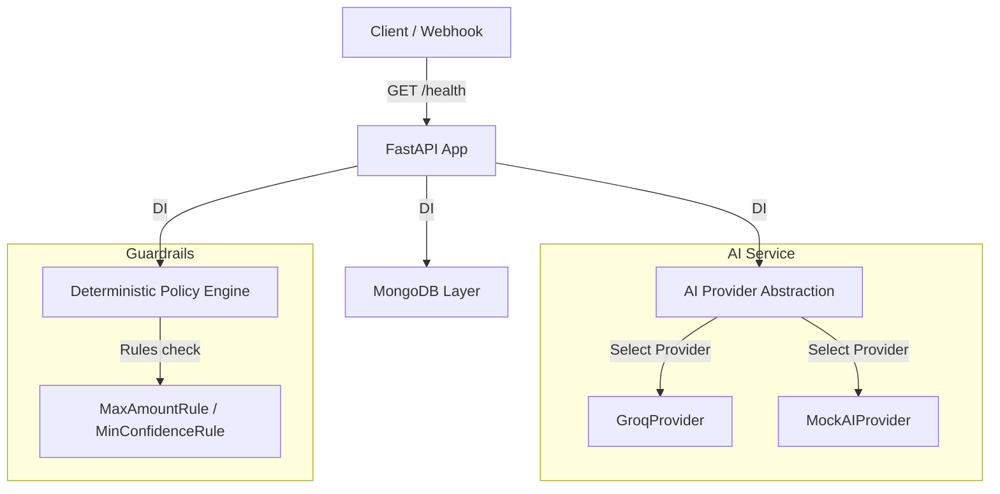

# RecoverAI Backend Foundation

AI Revenue Recovery Agent for Razorpay Test Mode.

---

## Track 03: AI Revenue Recovery

### Problem

Payment failures and degraded payment experiences can turn recoverable revenue into lost revenue. When transactions fail due to transient gateway issues, bank timeouts, or addressable user problems (such as expired cards or low balances), the lack of intelligent, automated recovery paths results in lost customers and reduced conversions.

### Planned Solution

We are building a multi-stage automated recovery engine following this pipeline:
```
Detect (Risk) ➔ Diagnose (Root Cause) ➔ Decide (AI Action) ➔ Guard (Policy Engine) ➔ Execute (Razorpay API) ➔ Verify (Status) ➔ Measure (Revenue) ➔ Audit (Logs)
```

### Current Status

This milestone establishes the **Backend Foundation** for the system. It implements configuration, FastAPI application structure, MongoDB connection pooling, domain schemas, an abstract AI Provider interface (with Groq implementation), and deterministic Policy Engine guardrails. 

*Note: The frontend dashboard, full AI agent dialogs, and direct Razorpay write integrations are planned for future phases.*

---

## Safety Principle

> [!IMPORTANT]
> **AI recommendations never directly authorize financial actions.** 
> All actions proposed by the AI Provider must first pass through the deterministic `PolicyEngine` (guardrails) before any future Razorpay operation can execute.

---

## Phase 2: Revenue Risk & Payment Intelligence

Phase 2 implements the deterministic Revenue Risk & Payment Intelligence Engine to convert raw payment records into structured recovery cases without making active AI calls (which are deferred to Phase 3).

### Workflow Pipeline

```
Payment Record ➔ Payment Analysis ➔ Revenue Risk Detection ➔ Amount At Risk ➔ Root Cause Classification ➔ Recovery Case
```

### Deterministic Engine Logic

1. **Risk Status Mapping**:
   * Successful payments (e.g. `captured`, `authorized`, `success`) ➔ `NOT_AT_RISK`
   * Failed payments with recoverable/transient issues ➔ `AT_RISK`
   * Unrecognized or ambiguous statuses ➔ `UNKNOWN`

2. **Root Cause Classification**:
   * Network, timeout, connection lost ➔ `TRANSIENT_FAILURE`
   * Insufficient funds/balance ➔ `CUSTOMER_FUNDS`
   * Issuing bank card declines, expired credentials ➔ `PAYMENT_DECLINED`
   * Unmapped or unknown gateway errors ➔ `UNKNOWN`

3. **Amount At Risk Calculation**:
   * Financial amounts strictly use minor units (paise for INR). No floating-point division is used.
   * If risk status is `AT_RISK` or `UNKNOWN` ➔ `amount_at_risk = payment.amount`
   * If risk status is `NOT_AT_RISK` ➔ `amount_at_risk = 0`

4. **Idempotency & Customer History**:
   * Analysis of a payment ID is fully idempotent. If a recovery case already exists for a payment, it is reused.
   * On case creation, customer payment history (total count, success count, failure count) prior to the target payment creation timestamp is fetched and attached to the recovery case for contextual intervention.

### API Endpoints

* **Payments**:
  * `GET /payments`: List stored payments (supports `limit` and `offset` paging).
  * `GET /payments/{payment_id}`: Retrieve a single payment record.
* **Risk & Recovery Cases**:
  * `POST /risk/analyze/{payment_id}`: Run deterministic risk analysis and return/create a recovery case.
  * `GET /risk/cases`: List recovery cases (supports `limit` and `offset` paging).
  * `GET /risk/cases/{case_id}`: Retrieve a specific recovery case by its ID.

#### Example API Response (`POST /risk/analyze/{payment_id}`)
```json
{
  "payment_id": "pay_syn_002",
  "risk_status": "AT_RISK",
  "amount_at_risk": 59900,
  "root_cause": "TRANSIENT_FAILURE",
  "recovery_case_id": "case_pay_syn_002"
}
```


---

## Phase 3: AI Recovery Decision Agent

Phase 3 implements the **AI Recovery Decision Agent**. The purpose of this phase is to allow the AI to analyze an existing revenue-recovery case and recommend an appropriate intervention.

### Core Security Principles

> [!IMPORTANT]
> **Advisory Only**: The AI recommends interventions but **never** directly authorizes or executes financial actions. It does not call Razorpay or modify payment states directly.
> **Deterministic Guardrails Control**: All AI recommendations are passed through the deterministic `PolicyEngine`. The engine retains the ultimate authority to permit (`ALLOW`), reject (`BLOCK`), or escalate for human review (`ESCALATE`) the recommendation.

### Pipeline Workflow

```
Recovery Case ➔ Context Builder ➔ AI Provider (Groq/Mock) ➔ Pydantic Validation ➔ PolicyEngine ➔ Persist & Audit
```

1. **Context Builder**: Constructs a structured, concise context snapshot, omitting any sensitive database IDs, credentials, or API keys.
2. **AI Provider**: Fetches the recommendation using either the live `GroqProvider` (via the Groq API) or `MockAIProvider` (for testing/local development).
   * **Prompt Injection Protection**: The system treats all untrusted external input (metadata, customer notes, failure reasons) strictly as data, instructing the AI model to ignore commands inside these fields.
   * **Failure Handling**: AI timeouts, rate limits, or validation errors gracefully fall back to a safe `ESCALATE` action.
3. **Structured AI Output**: Strictly validated using a Pydantic schema:
   * `action`: RETRY, REMIND, ESCALATE, STOP, or NO_ACTION
   * `confidence`: Normalized float between 0.0 and 1.0
   * `reason`: Short reasoning explanation
   * `risk_factors`: List of identified payment risks
   * `recommended_message_type`: SMS/Email template recommendation
   * `requires_human_review`: Boolean flag
4. **Policy Engine**: Validates the recommendation against safety rules:
   * `PaymentStatusRule`: Blocks retries on already successful or unknown payment states.
   * `RetryLimitRule`: Blocks retries if the case has already exceeded 3 retries.
   * `MinConfidenceRule`: Escalates the case if confidence is below 0.60.
   * `MaxAmountRule`: Escalates the case if the transaction value is high.
   * `EscalationRule`: Propagates any AI-recommended escalations.
5. **Persistence & Auditing**: Saves decisions to MongoDB (marking previous decisions as stale to track history) and writes a comprehensive audit trail to the logs.

### API Endpoints

* **POST `/recovery/{case_id}/decide`**:
  Triggers the decision pipeline for a specific recovery case.
  
  **Example API Response:**
  ```json
  {
    "case_id": "case_pay_syn_002",
    "ai_recommendation": {
      "action": "RETRY",
      "confidence": 0.91,
      "reason": "Transient payment failure with strong historical payment evidence."
    },
    "policy_decision": {
      "decision": "ALLOW",
      "reason": "Decision allowed by all guardrail rules"
    }
  }
  ```

### Manual Verification Script

You can run a manual test using the real Groq API:
```bash
# Requires setting GROQ_API_KEY in your .env
PYTHONPATH=. python scripts/test_groq.py
```

### Command Execution

#### 1. Seeding Synthetic Payments
Generates a reproducible, structured batch of synthetic payments (with historical context) using a random seed:
```bash
# Dry run to see distribution
python scripts/seed_data.py --count 500 --seed 42

# Confirm writing to MongoDB database
python scripts/seed_data.py --confirm --count 500 --seed 42
```

#### 2. Batch Risk Analysis
Analyzes all seeded payment records and outputs a high-level revenue risk report:
```bash
python scripts/analyze_risk_batch.py
```
*(Sample counts/amounts may vary depending on seed parameter).*

#### 3. Running Tests
Run complete pytest suite covering models, guardrails, classification, history, and API routes:
```bash
pytest
```

---

## Architecture Diagram

The backend foundation uses a clean separation of concerns:



---

## Setup & Execution

### 1. Clone the repository
```bash
git clone https://github.com/vikrambommanvb/Recover-AI-RAZORPAY.git
cd RecoverAI
```

### 2. Set up virtual environment
```bash
python3 -m venv .venv
source .venv/bin/activate
```

### 3. Install dependencies
```bash
pip install -r requirements.txt
```

### 4. Configure environment
Copy the configuration template and customize the values:
```bash
cp .env.example .env
```

### 5. Start the backend server
Start the FastAPI server locally:
```bash
uvicorn app.main:app --reload
```

Swagger API documentation will be available at: [http://127.0.0.1:8000/docs](http://127.0.0.1:8000/docs)

---

## Environment Variables

| Variable | Description | Default / Example |
| :--- | :--- | :--- |
| `APP_NAME` | Name of the FastAPI application | `RecoverAI` |
| `APP_ENV` | Running environment (development / production / testing) | `development` |
| `DEBUG` | Enable verbose error outputs and logs | `true` |
| `MONGODB_URI` | Connection string for MongoDB Atlas | `mongodb+srv://...` |
| `MONGODB_DATABASE` | Targeted database name | `recoverai` |
| `AI_PROVIDER` | Targeted AI model engine provider (`groq` or `mock`) | `groq` |
| `GROQ_API_KEY` | API Key for Groq Cloud services | `gsk_...` |
| `GROQ_MODEL` | Groq LLM model name | `mixtral-8x7b-32768` |
| `RAZORPAY_KEY_ID` | Razorpay Test Mode Key ID | *Optional for health check* |
| `RAZORPAY_KEY_SECRET` | Razorpay Test Mode Secret Key | *Optional for health check* |

---

## Testing

Execute tests using `pytest` inside the virtual environment:
```bash
pytest
```
