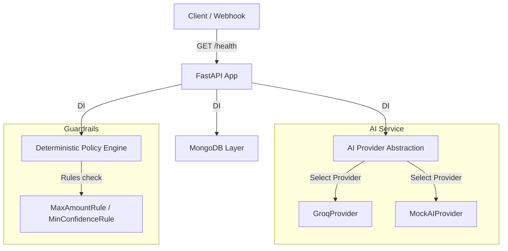

# RecoverAI Backend Foundation

AI Revenue Recovery Agent for Razorpay Test Mode.

---

## Track 03: AI Revenue Recovery

### Problem

Payment failures and degraded payment experiences can turn recoverable revenue into lost revenue. When transactions fail due to transient gateway issues, bank timeouts, or addressable user problems (such as expired cards or low balances), the lack of intelligent, automated recovery paths results in lost customers and reduced conversions.

### Planned Solution

We are building a multi-stage automated recovery engine following this pipeline:
```
Detect (Risk) ➔ Diagnose (Root Cause) ➔ Decide (AI Action) ➔ Guard (Policy Engine) ➔ Execute (Razorpay API) ➔ Verify (Status) ➔ Measure (Revenue) ➔ Audit (Logs)
```

### Current Status

This milestone establishes the **Backend Foundation** for the system. It implements configuration, FastAPI application structure, MongoDB connection pooling, domain schemas, an abstract AI Provider interface (with Groq implementation), and deterministic Policy Engine guardrails. 

*Note: The frontend dashboard, full AI agent dialogs, and direct Razorpay write integrations are planned for future phases.*

---

## Safety Principle

> [!IMPORTANT]
> **AI recommendations never directly authorize financial actions.** 
> All actions proposed by the AI Provider must first pass through the deterministic `PolicyEngine` (guardrails) before any future Razorpay operation can execute.

---

## Architecture Diagram

The backend foundation uses a clean separation of concerns:



---

## Setup & Execution

### 1. Clone the repository
```bash
git clone https://github.com/vikrambommanvb/Recover-AI-RAZORPAY.git
cd RecoverAI
```

### 2. Set up virtual environment
```bash
python3 -m venv .venv
source .venv/bin/activate
```

### 3. Install dependencies
```bash
pip install -r requirements.txt
```

### 4. Configure environment
Copy the configuration template and customize the values:
```bash
cp .env.example .env
```

### 5. Start the backend server
Start the FastAPI server locally:
```bash
uvicorn app.main:app --reload
```

Swagger API documentation will be available at: [http://127.0.0.1:8000/docs](http://127.0.0.1:8000/docs)

---

## Environment Variables

| Variable | Description | Default / Example |
| :--- | :--- | :--- |
| `APP_NAME` | Name of the FastAPI application | `RecoverAI` |
| `APP_ENV` | Running environment (development / production / testing) | `development` |
| `DEBUG` | Enable verbose error outputs and logs | `true` |
| `MONGODB_URI` | Connection string for MongoDB Atlas | `mongodb+srv://...` |
| `MONGODB_DATABASE` | Targeted database name | `recoverai` |
| `AI_PROVIDER` | Targeted AI model engine provider (`groq` or `mock`) | `groq` |
| `GROQ_API_KEY` | API Key for Groq Cloud services | `gsk_...` |
| `GROQ_MODEL` | Groq LLM model name | `mixtral-8x7b-32768` |
| `RAZORPAY_KEY_ID` | Razorpay Test Mode Key ID | *Optional for health check* |
| `RAZORPAY_KEY_SECRET` | Razorpay Test Mode Secret Key | *Optional for health check* |

---

## Testing

Execute tests using `pytest` inside the virtual environment:
```bash
pytest
```
