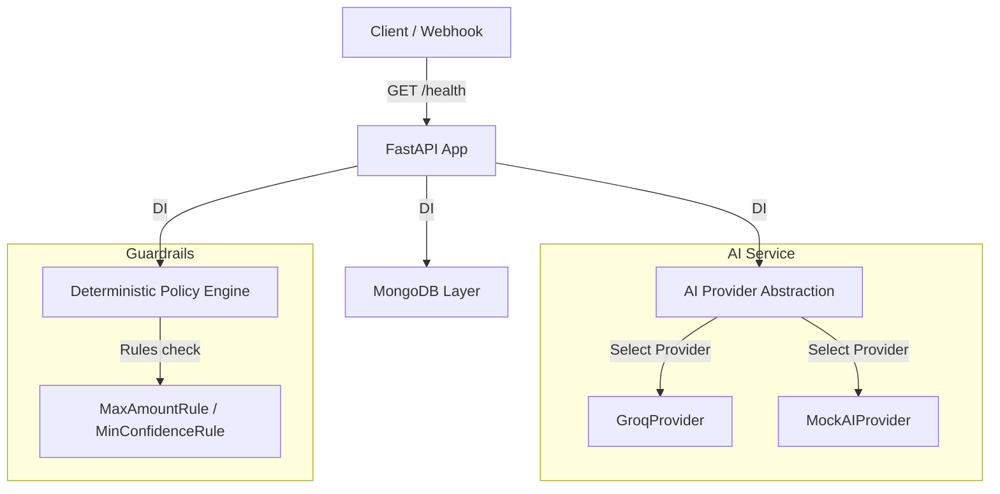

# RecoverAI Backend Foundation

AI Revenue Recovery Agent for Razorpay Test Mode.

---

## Track 03: AI Revenue Recovery

### Problem

Payment failures and degraded payment experiences can turn recoverable revenue into lost revenue. When transactions fail due to transient gateway issues, bank timeouts, or addressable user problems (such as expired cards or low balances), the lack of intelligent, automated recovery paths results in lost customers and reduced conversions.

### Planned Solution

We are building a multi-stage automated recovery engine following this pipeline:
```
Detect (Risk) ➔ Diagnose (Root Cause) ➔ Decide (AI Action) ➔ Guard (Policy Engine) ➔ Execute (Razorpay API) ➔ Verify (Status) ➔ Measure (Revenue) ➔ Audit (Logs)
```

### Current Status

This milestone establishes the **Backend Foundation** for the system. It implements configuration, FastAPI application structure, MongoDB connection pooling, domain schemas, an abstract AI Provider interface (with Groq implementation), and deterministic Policy Engine guardrails. 

*Note: The frontend dashboard, full AI agent dialogs, and direct Razorpay write integrations are planned for future phases.*

---

## Safety Principle

> [!IMPORTANT]
> **AI recommendations never directly authorize financial actions.** 
> All actions proposed by the AI Provider must first pass through the deterministic `PolicyEngine` (guardrails) before any future Razorpay operation can execute.

---

## Phase 2: Revenue Risk & Payment Intelligence

Phase 2 implements the deterministic Revenue Risk & Payment Intelligence Engine to convert raw payment records into structured recovery cases without making active AI calls (which are deferred to Phase 3).

### Workflow Pipeline

```
Payment Record ➔ Payment Analysis ➔ Revenue Risk Detection ➔ Amount At Risk ➔ Root Cause Classification ➔ Recovery Case
```

### Deterministic Engine Logic

1. **Risk Status Mapping**:
   * Successful payments (e.g. `captured`, `authorized`, `success`) ➔ `NOT_AT_RISK`
   * Failed payments with recoverable/transient issues ➔ `AT_RISK`
   * Unrecognized or ambiguous statuses ➔ `UNKNOWN`

2. **Root Cause Classification**:
   * Network, timeout, connection lost ➔ `TRANSIENT_FAILURE`
   * Insufficient funds/balance ➔ `CUSTOMER_FUNDS`
   * Issuing bank card declines, expired credentials ➔ `PAYMENT_DECLINED`
   * Unmapped or unknown gateway errors ➔ `UNKNOWN`

3. **Amount At Risk Calculation**:
   * Financial amounts strictly use minor units (paise for INR). No floating-point division is used.
   * If risk status is `AT_RISK` or `UNKNOWN` ➔ `amount_at_risk = payment.amount`
   * If risk status is `NOT_AT_RISK` ➔ `amount_at_risk = 0`

4. **Idempotency & Customer History**:
   * Analysis of a payment ID is fully idempotent. If a recovery case already exists for a payment, it is reused.
   * On case creation, customer payment history (total count, success count, failure count) prior to the target payment creation timestamp is fetched and attached to the recovery case for contextual intervention.

### API Endpoints

* **Payments**:
  * `GET /payments`: List stored payments (supports `limit` and `offset` paging).
  * `GET /payments/{payment_id}`: Retrieve a single payment record.
* **Risk & Recovery Cases**:
  * `POST /risk/analyze/{payment_id}`: Run deterministic risk analysis and return/create a recovery case.
  * `GET /risk/cases`: List recovery cases (supports `limit` and `offset` paging).
  * `GET /risk/cases/{case_id}`: Retrieve a specific recovery case by its ID.

#### Example API Response (`POST /risk/analyze/{payment_id}`)
```json
{
  "payment_id": "pay_syn_002",
  "risk_status": "AT_RISK",
  "amount_at_risk": 59900,
  "root_cause": "TRANSIENT_FAILURE",
  "recovery_case_id": "case_pay_syn_002"
}
```

### Command Execution

#### 1. Seeding Synthetic Payments
Generates a reproducible, structured batch of synthetic payments (with historical context) using a random seed:
```bash
# Dry run to see distribution
python scripts/seed_data.py --count 500 --seed 42

# Confirm writing to MongoDB database
python scripts/seed_data.py --confirm --count 500 --seed 42
```

#### 2. Batch Risk Analysis
Analyzes all seeded payment records and outputs a high-level revenue risk report:
```bash
python scripts/analyze_risk_batch.py
```
*(Sample counts/amounts may vary depending on seed parameter).*

#### 3. Running Tests
Run complete pytest suite covering models, guardrails, classification, history, and API routes:
```bash
pytest
```

---

## Architecture Diagram

The backend foundation uses a clean separation of concerns:



---

## Setup & Execution

### 1. Clone the repository
```bash
git clone https://github.com/vikrambommanvb/Recover-AI-RAZORPAY.git
cd RecoverAI
```

### 2. Set up virtual environment
```bash
python3 -m venv .venv
source .venv/bin/activate
```

### 3. Install dependencies
```bash
pip install -r requirements.txt
```

### 4. Configure environment
Copy the configuration template and customize the values:
```bash
cp .env.example .env
```

### 5. Start the backend server
Start the FastAPI server locally:
```bash
uvicorn app.main:app --reload
```

Swagger API documentation will be available at: [http://127.0.0.1:8000/docs](http://127.0.0.1:8000/docs)

---

## Environment Variables

| Variable | Description | Default / Example |
| :--- | :--- | :--- |
| `APP_NAME` | Name of the FastAPI application | `RecoverAI` |
| `APP_ENV` | Running environment (development / production / testing) | `development` |
| `DEBUG` | Enable verbose error outputs and logs | `true` |
| `MONGODB_URI` | Connection string for MongoDB Atlas | `mongodb+srv://...` |
| `MONGODB_DATABASE` | Targeted database name | `recoverai` |
| `AI_PROVIDER` | Targeted AI model engine provider (`groq` or `mock`) | `groq` |
| `GROQ_API_KEY` | API Key for Groq Cloud services | `gsk_...` |
| `GROQ_MODEL` | Groq LLM model name | `mixtral-8x7b-32768` |
| `RAZORPAY_KEY_ID` | Razorpay Test Mode Key ID | *Optional for health check* |
| `RAZORPAY_KEY_SECRET` | Razorpay Test Mode Secret Key | *Optional for health check* |

---

## Testing

Execute tests using `pytest` inside the virtual environment:
```bash
pytest
```
